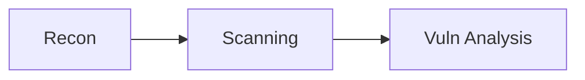

# Kambo Viz — Visual Intelligence

Generates Mermaid.js diagrams from session data and renders them in the browser.
Use during hunting sessions to understand attack vectors, track progress, and
communicate findings visually.

## Available Diagrams

### 1. Attack Surface (`/kambo-viz surface`)

Mindmap showing the target hierarchy:
- Root domain
- WAF layer
- Subdomains (grouped)
- Open ports / services
- Tech stack
- Findings overlay

**When to use**: After recon phase to visualize the attack surface.

**Data sources**: `recon_subdomains`, `recon_ports_fast`, `recon_tech_stack`, `recon_waf`

### 2. Finding Flow (`/kambo-viz flow`)

Flowchart showing the pipeline:
```
Recon → Scanning → Vuln Analysis → Exploitation → Reporting
```
With findings attached to each phase, colored by severity, shaped by confidence.

**When to use**: Mid-session to see progress and identify gaps.

### 3. Confidence Tree (`/kambo-viz confidence`)

Tree diagram grouping findings by confidence level:
- CONFIRMED (green) — ready to report
- FIRM (orange) — needs exploitation
- TENTATIVE (gray) — needs validation

Each finding shows severity, evidence weight, and signal count.

**When to use**: Before reporting to prioritize findings.

### 4. Session Timeline (`/kambo-viz timeline`)

Gantt chart showing:
- Phase durations
- Tool executions within phases
- Total session time

**When to use**: After session to analyze time investment.

### 5. ROI Waterfall (`/kambo-viz roi`)

Waterfall chart showing value contribution per finding:
- Each finding adds its expected value
- Readiness status (+, ~, ?, x)
- Total expected value
- $/hour ROI

**When to use**: Before reporting to prioritize by value.

### 6. Tool Scorecard (`/kambo-viz scorecard`)

Quadrant chart comparing tools by:
- X: Finding rate (yield)
- Y: Precision (accuracy)

Quadrants: Elite / Precise but Slow / Noisy but Productive / Broken

**When to use**: After `/kambo-refine` to evaluate tool performance.

## How to Render

### Option A: Browser (recommended)

Generate HTML and open in browser:
```python
from kambo.visualizer import attack_surface, render_html
from pathlib import Path

mermaid = attack_surface("target.com", subdomains=[...])
html = render_html(mermaid, title="Attack Surface — target.com")
Path("/tmp/kambo-viz.html").write_text(html)
# Open in browser via gstack browse or system open
```

### Option B: Markdown embed

Paste the raw Mermaid syntax into any markdown renderer:
````markdown

````

### Option C: Claude Code output

Print the Mermaid code directly — Claude Code renders it in compatible terminals.

## Workflow Integration

### During `/kambo-hunt`:
- After recon: generate `attack_surface` to plan scanning
- After vulns: generate `finding_flow` to see gaps
- Before reporting: generate `confidence_tree` + `roi_waterfall`

### During `/kambo-refine`:
- Generate `tool_scorecard` to evaluate performance
- Generate `session_timeline` to analyze time investment

### In reports:
- Embed Mermaid diagrams in bounty reports for visual evidence
- Use `confidence_tree` to show evidence chain quality
